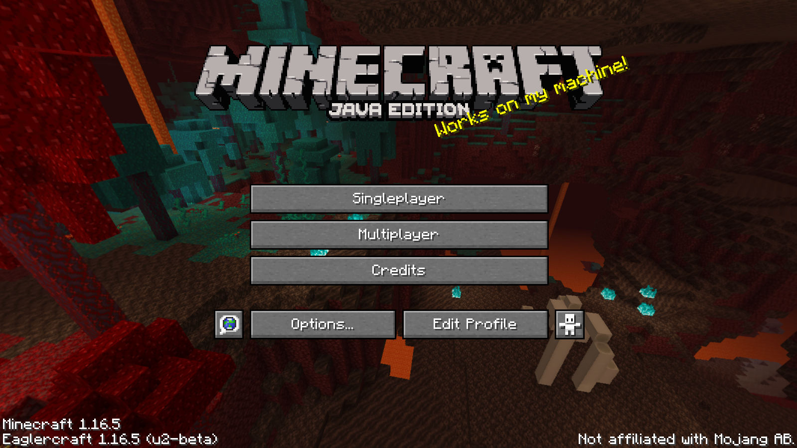
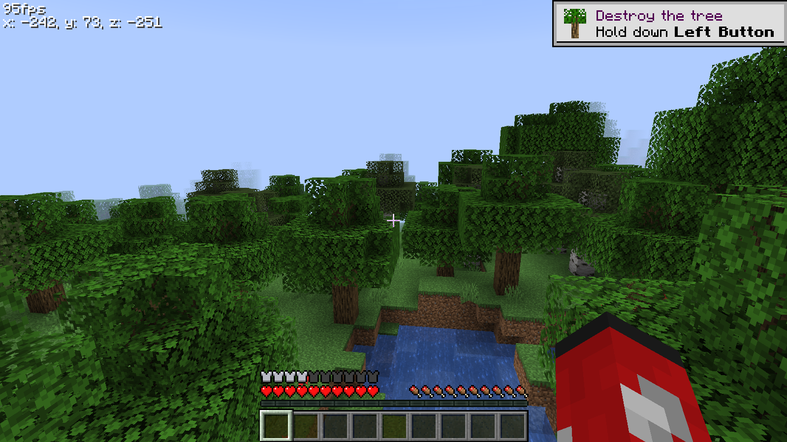

# Eaglercraft 1.16.5

Minecraft 1.16.5, ported to run **entirely in your browser**. No installs, no launchers, no Java required — open a link and you're in a real singleplayer world or on a real multiplayer server, straight from the tab.

  
  
  

  
  

## What is this?

A full source port of Minecraft 1.16.5 (client + integrated server) onto the EaglercraftX runtime, compiled to WebAssembly with TeaVM so it runs natively in any modern browser. Not a cloud-streamed version, not a re-skinned clone — the actual game, running client-side on your machine, in your tab.

## Features

- **Runs 100% in-browser** — compiled to WebAssembly (WASM-GC), no plugins
- **Real singleplayer** — actual world generation and saves, stored locally in your browser
- **Multiplayer** — join real servers through relay support
- **Skins & capes** — import your own
- **Resource pack support**
- **Offline build** — download once, play with zero internet after that

## Play

| | |
|---|---|
| ▶️ **Play in browser** | [techyako.github.io/Eaglercraft-1.16.5](https://techyako.github.io/Eaglercraft-1.16.5/) |
| ⬇️ **Offline download** | grab the standalone build from the launcher page above |

Two builds are available from the launcher: **u2-beta** (latest, WASM-GC) and **u1-beta** (legacy).

## Community

Bugs, updates, and behind-the-scenes stuff happen on Discord:

## Disclaimer

Not affiliated with Mojang or Microsoft. Minecraft is a trademark of Mojang Synergies AB.

---

Ported by **AcornDev**
